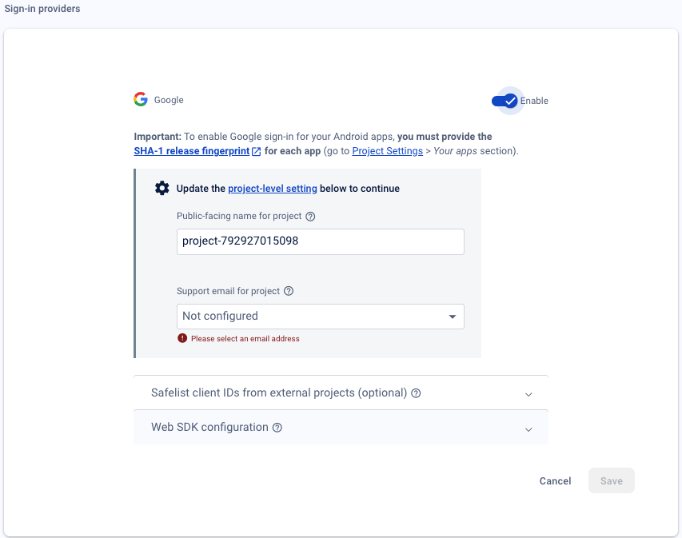

Firebase is Google’s cross-platform app development platform. It provides fully managed backend service infrastructure for web based, android or iOS applications.

Firebase provides extensions for common development tasks like authentication, payments, email, etc — which can be added per project basis.

## Create Firebase Project

1. Sign in into your Google account.
2. You need to create a Firebase project, if you don’t already have one. Go to Firebase console [here](https://console.firebase.google.com/) - create a new project. Example: `flutter-starter-kit`. Feel free to disable Google Analytics for this project. Either way, it will not matter - you can enable it later from Project Settings → Integrations.


## Required Tools for Firebase - Flutter integration

### Firebase CLI

Installing Firebase CLI locally will help you manage, test and deploy Firebase project from your command line. It is required to perform Firebase <> Flutter integration as we will be modifying Firebase resources through our runtime environment.

To download and install Firebase CLI, you have two options:

**Option 1:** Through node package:
```bash
npm install -g firebase-tools
```

**Option 2:** Through Standalone Binary without any dependency

```bash
curl -sL firebase.tools | bash
```

Verify your installation by running **`firebase --help`.** More help on Firebase tools can be found here: https://firebase.google.com/docs/cli.

Log into Firebase with your Google account using this command:

```bash
firebase login
```

### FlutterFire CLI

FlutterFire CLI is used to create Firebase app for target development environment (Android/iOS/Web/macOS) in your existing Firebase project. It is also possible to create new project through FlutterFire.

Run this command from any directory to install:

```bash
dart pub global activate flutterfire_cli
```

## Add Firebase to your Flutter project

This command runs the worflow to add apps to your Firebase project and generate necessary files for your Flutter project to use Firebase:
```bash
flutterfire configure
```

1. Asks you to select the platforms (iOS, Android, Web) that you want to support in your Flutter app. For each selected platform, the FlutterFire CLI creates a new Firebase app in your Firebase project.
2. Creates a Firebase configuration file (`firebase_options.dart`) and adds it to your `lib/` directory. 

    > **👋 Note:** `firebase_options.dart` file is already included in the project. This command is supposed to override the existing file and add your selected platforms. It will also make changes in `ios` and `android` folders.

3. Generates a `google-services.json` file for each platform that you selected.
4. Adds the necessary dependencies to your `pubspec.yaml` file.
4. Adds the necessary code to your `AndroidManifest.xml` file for Android.
