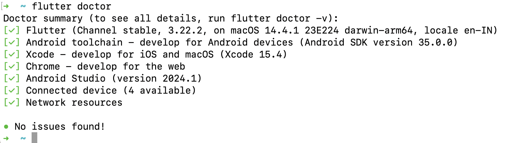
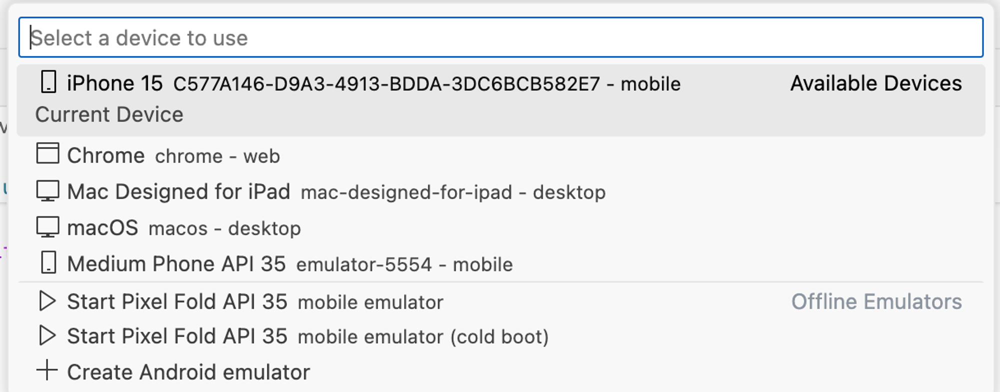
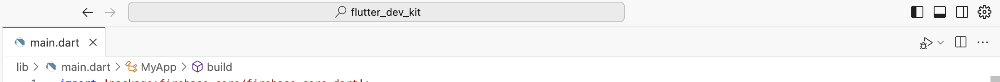

Flutter provider quite intensive guide on installation for different platforms: https://docs.flutter.dev/get-started/install

Choose your development environment and target device to get started. 

### Overview

1. Make sure you are working with system with minimum 8GB RAM, 4 core CPU and enough free disk space. This is to ensure enough resources and speed when running the project locally.
2. You need to install Git for cloning project and running some flutter commands. Here is the guide in case you need it: https://github.com/git-guides/install-git
3. Android Studio for Windows and XCode for Mac is necessary to debug and compile code. CocoaPods are additionally required for iOS.
4. Download Flutter SDK and add it to the PATH. For Mac, CocoaPods is also required in the PATH.
5. Download the device emulators for Android/iOS to run the code locally.
6. Download your favourite IDE: VSCode or Cursor or Android Studio. I encourage you to try Cursor IDE. 

### Verify Installation

Whether you followed Windows/Mac setup, run `flutter doctor` to verify that flutter is setup correctly. Don’t worry - everything may not be check for you. It depends on the development environment you have chosen.



### Start with Flutter Dev Kit

1. Go to the directory where you want to place your project.
    
    ```bash
    git clone https://github.com/mahima-manik/flutter-starter-kit.git
    cd flutter-starter-kit
    ```
    

1. To download all project dependencies listed in `pubspec.yaml`, run this:
    
    ```bash
    flutter pub get
    ```
    
    Notice it will generate `build/` folder in project root directory
    
2. Select a device from bottom-right corner of your VSCode editor. 
    
    
    
3. Go to `lib/main.dart` , you will see a debug and run button on top-right corner of IDE. It performs the build, installs and run the application on selected device.
    
    
    
    Run button on top-right
    
    Or you can run using the command: 
    
    ```bash
    flutter run
    ```
    
    <div align="center">
        </img>
    </div>
    

Congratulations! 🥳 You have successfully run the project! Now we will make it feature rich step by step.
